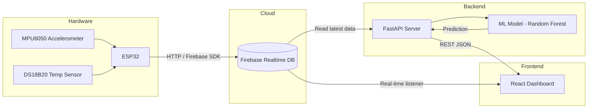

# BearingPulse — Bearing Health Prediction System

A full-stack IoT + ML system that predicts the health of industrial bearings using vibration, acceleration, temperature, and frequency-spectrum data collected by an ESP32.

## System Architecture



---

## Technology Stack

| Layer | Technology | Why |
|-------|-----------|-----|
| **Sensors** | MPU6050 + DS18B20 | Accelerometer for vibration/FFT, temp sensor |
| **Microcontroller** | ESP32 (Arduino) | Wi-Fi enabled, sufficient ADC/GPIO |
| **Database** | Firebase Realtime Database | Real-time sync, free tier, easy ESP32 SDK |
| **ML Model** | Python · scikit-learn (Random Forest) | Lightweight, interpretable, fast inference |
| **Backend API** | Python · FastAPI | Async, auto-docs, easy Firebase Admin SDK |
| **Frontend** | Vite + React + Recharts | Fast dev server, modern UI, great charting |
| **Styling** | Vanilla CSS (dark industrial theme) | Full control, no build dependency |

---

## Proposed Changes

### 1. Project Structure (Root)

#### [NEW] Project scaffolding

```
e:\BearingPulse\
├── frontend/          # Vite + React dashboard
├── backend/           # FastAPI + ML model
│   ├── app/
│   │   ├── main.py           # FastAPI app
│   │   ├── firebase_client.py # Firebase Admin SDK
│   │   ├── ml_model.py       # Model loading & prediction
│   │   └── schemas.py        # Pydantic models
│   ├── model/
│   │   ├── train_model.py    # Training script
│   │   ├── generate_data.py  # Synthetic data generator
│   │   └── bearing_model.pkl # Saved model artifact
│   └── requirements.txt
├── firmware/          # ESP32 Arduino sketch
│   └── BearingPulse.ino
└── README.md
```

---

### 2. Backend — ML Model

#### [NEW] `backend/model/generate_data.py`
Generate **synthetic training data** simulating real bearing conditions:

| Feature | Healthy Range | Degraded Range | Critical Range |
|---------|-------------|----------------|----------------|
| RMS Vibration (mm/s) | 0.5 – 2.0 | 2.0 – 5.0 | 5.0 – 15.0 |
| Peak Acceleration (g) | 0.1 – 1.0 | 1.0 – 5.0 | 5.0 – 20.0 |
| Temperature (°C) | 25 – 45 | 45 – 70 | 70 – 120 |
| FFT Dominant Freq (Hz) | 10 – 100 | 100 – 500 | 500 – 2000 |
| FFT Peak Amplitude | 0.01 – 0.1 | 0.1 – 0.5 | 0.5 – 2.0 |

Labels: `Healthy` (0), `Degraded` (1), `Critical` (2)

~5,000 samples with realistic noise and overlap at boundaries.

#### [NEW] `backend/model/train_model.py`
- Train a **Random Forest Classifier** (100 estimators)
- Feature engineering: compute derived features (vibration × temperature interaction, log-scaled FFT amplitude)
- Train/test split (80/20), cross-validation
- Save model as `bearing_model.pkl` via `joblib`
- Print classification report + confusion matrix

---

### 3. Backend — FastAPI Server

#### [NEW] `backend/app/main.py`
- `GET /api/health` — health check
- `GET /api/readings/latest` — fetch latest sensor reading from Firebase
- `GET /api/readings/history?limit=50` — fetch recent readings
- `POST /api/predict` — accept sensor features, return prediction + confidence
- `GET /api/predict/latest` — predict on latest Firebase reading
- CORS middleware for frontend

#### [NEW] `backend/app/firebase_client.py`
- Initialize Firebase Admin SDK with service account
- Functions: `get_latest_reading()`, `get_reading_history(limit)`

#### [NEW] `backend/app/ml_model.py`
- Load `bearing_model.pkl` at startup
- `predict(features)` → `{ status, confidence, class_probabilities }`

#### [NEW] `backend/app/schemas.py`
- Pydantic models for request/response validation

---

### 4. Frontend — React Dashboard

#### [NEW] Vite + React app in `frontend/`

**Pages / Components:**

| Component | Purpose |
|-----------|---------|
| `App.jsx` | Root layout, dark theme, navigation |
| `Dashboard.jsx` | Main page with all widgets |
| `SensorCard.jsx` | Individual sensor metric card (RMS, Temp, etc.) |
| `HealthGauge.jsx` | Large health status indicator (Healthy/Degraded/Critical) |
| `TrendChart.jsx` | Historical line chart (Recharts) |
| `FFTChart.jsx` | Bar/line chart for frequency spectrum |
| `SystemFlow.jsx` | Animated system architecture diagram |
| `PredictionPanel.jsx` | ML prediction result + confidence bars |

**Design:**
- Dark industrial theme (deep navy `#0a0e27`, neon accents `#00f0ff`, `#ff6b6b`)
- Glassmorphism cards with `backdrop-filter`
- Animated health gauge with CSS transitions
- Responsive grid layout
- Real-time data auto-refresh every 5 seconds

---

### 5. Firebase — Database Schema

```json
{
  "bearingpulse": {
    "readings": {
      "<auto-id>": {
        "timestamp": 1710500000,
        "rms_vibration": 1.23,
        "peak_acceleration": 0.87,
        "temperature": 38.5,
        "fft_dominant_freq": 45.2,
        "fft_peak_amplitude": 0.05,
        "device_id": "ESP32_001"
      }
    },
    "predictions": {
      "<auto-id>": {
        "timestamp": 1710500005,
        "reading_id": "<reading-id>",
        "status": "Healthy",
        "confidence": 0.94,
        "probabilities": { "Healthy": 0.94, "Degraded": 0.04, "Critical": 0.02 }
      }
    }
  }
}
```

---

### 6. ESP32 Firmware

#### [NEW] `firmware/BearingPulse.ino`
- Read MPU6050 via I2C (acceleration X/Y/Z → compute RMS, peak)
- Read DS18B20 via OneWire (temperature)
- Compute basic FFT using `arduinoFFT` library (dominant frequency, peak amplitude)
- Push JSON to Firebase Realtime Database via HTTP REST API
- Interval: every 2 seconds

> [!IMPORTANT]
> The ESP32 firmware is provided as a reference. You will need to:
> 1. Install the Arduino IDE with ESP32 board support
> 2. Create a Firebase project and get the database URL + API key
> 3. Update Wi-Fi credentials and Firebase config in the sketch
> 4. Wire MPU6050 (I2C: SDA→GPIO21, SCL→GPIO22) and DS18B20 (data→GPIO4)

---

## User Review Required

> [!IMPORTANT]
> **Firebase Configuration**: You will need to create a Firebase project and share:
> 1. A **service account JSON key** (for the Python backend)
> 2. The **Firebase Realtime Database URL** (e.g., `https://your-project.firebaseio.com`)
> 3. The **Web API Key** (for the ESP32 firmware)
> 4. The **Firebase web config** (for the React frontend, if using client SDK)

> [!WARNING]
> **ML Model**: Since we don't have real sensor data yet, the model will be trained on **synthetic data** that mimics realistic bearing degradation patterns. Once you collect real data from the ESP32, the model should be retrained for production accuracy.

> [!NOTE]
> **Scope clarification**: Should I implement all layers (firmware + backend + frontend) in this phase, or would you prefer to start with just the **backend ML model + dashboard** and add the ESP32 firmware later?

---

## Verification Plan

### Automated Tests
1. **ML Model**: Run `train_model.py`, verify accuracy > 90% on synthetic test set, print classification report
2. **API**: Start FastAPI server, test endpoints with `curl`:
   ```bash
   curl http://localhost:8000/api/health
   curl -X POST http://localhost:8000/api/predict -H "Content-Type: application/json" -d '{"rms_vibration":1.5,"peak_acceleration":0.8,"temperature":35,"fft_dominant_freq":50,"fft_peak_amplitude":0.03}'
   ```
3. **Frontend**: Run `npm run dev`, open in browser, verify dashboard renders with mock/real data

### Manual Verification
- Open the dashboard in a browser and confirm:
  - Sensor cards display values
  - Health gauge shows correct color-coded status
  - Charts render with historical data
  - Prediction panel shows ML output with confidence
- If Firebase is configured: verify real-time data flow from a test push
